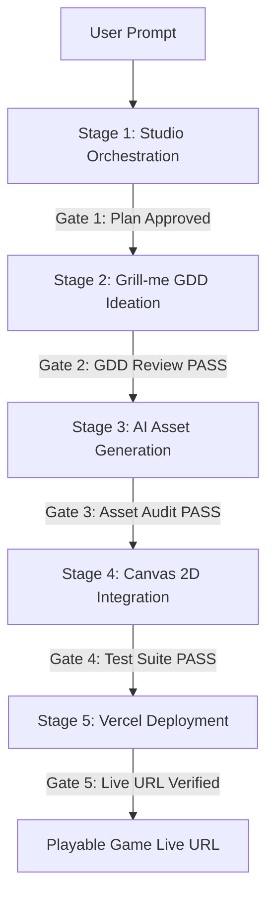

# H5 Game Studio Pipeline

> An open-source, studio-grade agentic workflow skill for transforming a single creative prompt into an online-deployed, playable H5 Canvas 2D web game.

## Overview

The **H5 Game Studio Pipeline** operates on an **Orchestrator Architecture**: a lead agent (acting as Studio Producer / Orchestrator) diagnoses project stage, routes specialist tasks, enforces quality gates, and assembles final deliverables without directly editing code or creating art.

```
                  ┌──────────────────────────────────────────────┐
                  │          Orchestrator (Lead Agent)           │
                  │   Diagnoses ➔ Routes ➔ Gates ➔ Assembles    │
                  └──────┬──────────────┬──────────────┬─────────┘
                         │              │              │
        ┌────────────────┴┐    ┌────────┴────────┐   ┌─┴───────────────┐
        │design-strategist│    │  art-director   │   │engineering-lead │
        │  (grill-me/GDD) │    │(agnes-ai/Assets)│   │ (Canvas2D Code) │
        └─────────────────┘    └─────────────────┘   └─────────────────┘
```

## When to Use

- **Full Lifecycle Game Creation**: User provides a prompt (e.g., *"Build a dark-fantasy pixel idle RPG with an auction house"*) and expects an online-deployed game.
- **Structured GDD Ideation**: Decomposing vague ideas into a rigorous Game Design Document via interactive reverse interviews (*grill-me mode*).
- **Automated AI Asset Pipeline**: Generating and integrating character sprites, weapon PNGs, and skill badges using AI image generation (`agnes-ai`).
- **Canvas 2D Framework Integration**: Integrating generated assets into standard H5 Canvas 2D engines without rewriting core rendering loops.
- **Serverless Production Deployment**: Deploying the game to Vercel with cloud DB persistence (Turso/LibSQL) and environment secret isolation.

Do **NOT** use when:
- Fixing localized syntax bugs or single-function issues (route directly to `engineering-lead`).
- Modifying standard backend APIs without affecting game mechanics or UI design.

---

## The 5-Stage Pipeline



| Stage | Milestone Name | Lead Specialist | Key Deliverable | Quality Gate (Pass Criteria) |
|-------|----------------|-----------------|-----------------|------------------------------|
| **1** | Studio Orchestration | Orchestrator | Execution Plan | User explicit approval of plan |
| **2** | Grill-me GDD Ideation | `design-strategist` | `docs/GDD.md` | Core loop, mechanics & balance complete |
| **3** | AI Asset Generation | `art-director` (+ `agnes-ai`) | PNG Sprites & Icons | Specs, transparency & fallback PASS |
| **4** | Canvas 2D Integration | `engineering-lead` | Runnable Canvas Game | Registry check & test suite 100% PASS |
| **5** | Vercel Deployment | `release-ops-lead` | Live Vercel Production URL | HTTP 200 health check & online play verified |

---

## Workflow Execution SOP

### Stage 1: Studio Orchestration (主理人统筹)
1. Inspect project structure (`index.html`, `config.js`, `server/db.js`, `api/index.js`, `vercel.json`).
2. Identify existing features, assets, and database architecture.
3. Formulate a 5-stage milestone execution plan.
4. **Gate 1**: Present the plan to the user. **Obtain explicit user approval before proceeding.**

### Stage 2: Grill-me GDD Ideation (grill-me 拆解)
1. Spawn `design-strategist` in *grill-me* interview mode (see [grill-me-framework.md](references/grill-me-framework.md)).
2. Conduct reverse questioning across 4 dimensions:
   - **Core Verb & Loop**: Combat, movement, idle progression, resources.
   - **Visual & Audio Aesthetic**: Dark fantasy, pixel art, cyberpunk, VFX.
   - **Progression & Economy**: Stat scaling, gear rarities, gold sinks.
   - **Unique Features**: Auction house, skill trees, boss phases.
3. Provide 2–4 concise options for key design choices.
4. Output structured `docs/GDD.md` (see [gdd-template.md](references/gdd-template.md)).
5. **Quality check**: Before Gate 2, verify the GDD passes both:
   - the [design-principles.md](references/design-principles.md) sanity bars — a 30-second core loop exists, ≥2 Bartle player types are served, reward schedule is mixed, difficulty curve has early wins + breathing room;
   - the [systems-mechanics.md](references/systems-mechanics.md) design gates — a **Fun Hypothesis** is written, **3–5 Design Pillars** filter decisions, the **three-layer core loop** (moment/session/long-term) is drafted, the **Sources/Sinks ledger** is balanced (every resource has a sink), and key numbers carry a rationale or `[PLACEHOLDER]`;
   - the [level-design.md](references/level-design.md) level gates — **Level Intent** written (implies ≥1 unique layout decision), **Shape Language** annotated per segment, **Pacing Chart** has no flatline, **Flow Diagram** drawn (every fork has visible reward + merge, no true dead ends), **Encounter Table** complete (read time + ≥2 tactics + fallback per encounter), **navigation readability checklist** all ticked;
   - the [narrative-design.md](references/narrative-design.md) narrative gates — **Narrative Core** written (theme question + logline + pillars), **Protagonist Desire/Need conflict** set, **Beat Sheet** with a gameplay delivery point per beat, **Alignment Matrix** with no empty rows (every beat ≥1 gameplay consequence), **dialogue sample** passes Voice Pillars (real-person test, no as-you-know), **Tier 1 critical path** comprehensible without optional content, **World Bible** free of internal contradictions.
6. **Gate 2**: User reviews and approves GDD.

### Stage 3: AI Asset Generation (免费文生图自动生成)
1. Spawn `art-director` to craft prompts based on `docs/GDD.md`. **Tech-spec first**: before generating, lock asset dimensions & texture memory budget per [tech-art.md](references/tech-art.md) §2, and plan atlas/pre-bake assets per §3–§4 (icons/effects into `fx.atlas`/`ui.atlas`, baked lightmaps & glows pre-rendered).
2. Invoke `agnes-ai` skill (`agnes-image-2.1-flash`) to generate:
   - Character Class Avatars (`art-app/assets/<class>_front.png`)
   - 16 Weapon Icons (`assets/weapons/<weaponType>.png`)
   - Skill Icons (`art-app/assets/icon_<skillId>.png`)
3. Execute `python scripts/make_transparent.py` to produce clean PNG alpha channels.
4. **Naming discipline**: Generate files following the [design-principles.md](references/design-principles.md) art naming convention (`[type]_[object]_[variant]_[state].png`) and folder layout, so Stage 4 integration is zero-touch mapping (see also [asset-mapping.md](references/asset-mapping.md)).
5. **Gate 3**: Verify image files exist, have non-zero size, and meet resolution specs **plus the tech-art asset spec checklist** ([tech-art.md](references/tech-art.md) §10 Gate 3): sizes follow the dimension ladder, texture memory within budget, naming compliant, atlas planned, pre-bake assets generated, VFX spec table filled.

### Stage 4: Canvas 2D Integration (Canvas 2D 自动接入)
1. Spawn `engineering-lead` to map generated assets into `config.js` and engine loops (see [asset-mapping.md](references/asset-mapping.md) — atlas JSON slices become the new mapping entry per [tech-art.md](references/tech-art.md) §3.1).
2. **Pre-flight**: Consult [pitfalls.md](references/pitfalls.md) for integration-time traps — panel lifecycle (P01/P02), asset path mapping (P06), canvas blur/DPR (P03/P04), frame-rate independence (P10), pointer events (P14). Also apply [design-principles.md](references/design-principles.md) perf/architecture rules — fixed-timestep loop, object pooling (P22), dirty-flag updates (P24), draw-call batching (P25), canvas state save/restore balance (P26), tab-hidden pause (P23). **And apply [tech-art.md](references/tech-art.md) rendering rules** — pre-bake static layers & lightmaps (§3–§4), zero `filter`/`shadowBlur` (§1), additive layer caps (§4.2), per-platform effect tiers (§5), budget table checks (§6). **And apply [engine-optimization.md](references/engine-optimization.md) engine rules** — fixed-timestep loop + interpolation (§1.1), performance budget table stood up on day 1 (§2), profile-before-optimize SOP (§3), object pooling & dirty flags (§5.1–5.2), spatial-hash collision for >50 entities (§5.3), progressive loading ≤2MB first paint (§7), dt clamp + background pause (§8.1), performance HUD (§9), benchmark scenes for regression (§10).
3. Preserve native Canvas 2D rendering pipeline and fallback mechanisms (`PNG -> SVG -> Emoji`).
4. Run automated registry check `node scripts/verify_integration.js` and logic tests.
5. **Gate 4**: All logic tests and integration checks return 100% PASS **plus the tech-art render performance checklist** ([tech-art.md](references/tech-art.md) §10 Gate 4): per-frame drawImage/source-switch/particle/additive counts within budget, zero filter/shadowBlur, static layers pre-baked, pixel-art integer scaling & HD dpr ≤2, low-tier profile holds 30FPS. **Plus the engine performance gate** ([engine-optimization.md](references/engine-optimization.md) §10): benchmark scenes (main city / boss peak / bullet hell / background switch) measured — FPS mean & P1 within budget, no perf regression vs baseline, first-paint ≤2MB, memory within budget, GC stalls absent.

### Stage 5: Vercel Deployment & Cloud DB (Vercel 部署与 Turso 云数据库)
- **Role**: `release-ops-lead`
- **Pre-flight**: Consult [pitfalls.md](references/pitfalls.md) for serverless/static-site traps — no WS/cron (P17), static-site analytics snippet (P16), lockfile merge (P18), non-interactive git push auth (P19), cloud-save isolation (P15).
- **Action**: Configure `vercel.json` and environment variables (`TURSO_DATABASE_URL`, `TURSO_AUTH_TOKEN`). Verify the server's 3-tier database fallback (`Turso LibSQL Cloud` -> `node:sqlite` -> `db.json fallback`). Execute `npx vercel --prod`.
- **Deliverable**: Live production game link (e.g., `https://<app-name>.vercel.app`) with serverless cloud save (`save:${userId}:${slot}`) and auction house persistence.
- **Gate 5**: HTTP GET health check on `/api/health` and verify cloud save/auction house functionality.

---

## Studio Roles & Subagent Routing Table

| Trigger Keyword / Focus | Spawn Target | Primary Deliverable |
|-------------------------|--------------|---------------------|
| GDD, 概念, 创意, grill-me, 关卡, 地图, 流程, 节奏, 遭遇, 数值, 叙事, 剧情, 角色, 对话, 世界观 | `design-strategist` | System & Game Design, GDD, Grill-me Interview, **Level Design** (see `references/level-design.md`), **Narrative Design** (see `references/narrative-design.md`) |
| 架构, 引擎, 代码, 性能, 集成, 接入, 帧率, 加载, 内存, 优化, 卡顿 | `engineering-lead` | Code Architecture, Canvas 2D Engine Integration, **Engine & Performance Optimization** (see `references/engine-optimization.md`) |
| 美术, 视觉, 资产规格, 特效, 图标, 图集, 材质, 渲染, 粒子, 性能优化, 技术美术 | `art-director` | Art Specs & `agnes-ai` Image Generation, **Technical Art** (see `references/tech-art.md`) — 渲染方案/VFX 实现/资产预算，`engineering-lead` 配合实现 |
| 音乐, 音效, 混音 | `audio-director` | SFX & BGM Implementation Strategy |
| 测试, 冒烟, 回归, 质量门 | `quality-lead` | Test Suite Execution & Gate Verdicts |
| 发布, 部署, vercel, 线上链接 | `release-ops-lead` | Vercel Deployment & Secret Verification |

---

## Iron Laws & Red Flags

> [!IMPORTANT]
> **Core Principle**: Orchestrator orchestrates only. It NEVER writes GDD text, game code, or image files directly.

### Iron Laws
1. **Orchestrator Orchestrates Only**: The lead agent coordinates subagents and enforces quality gates, never writing GDD, code, or assets directly.
2. **Strict Handoff Boundary**: Specialist subagents do not communicate directly; all context handoffs route through the Orchestrator.
3. **No Unapproved Modifications**: File writes require explicit user awareness or approval.
4. **Quality Gates Mandatory**: Stage progression is forbidden until the Quality Gate PASS criteria are met.

### Rationalization Table & Countermeasures

| Agent Rationalization | Reality & Enforcement Rule |
|-----------------------|----------------------------|
| *"The prompt is simple enough to skip Stage 2 grill-me."* | **Forbidden.** Vague prompts lead to mismatched assets and broken Canvas mappings. Grill-me is mandatory. |
| *"Writing code directly in parent context saves tokens."* | **Forbidden.** Violates Orchestrator separation of concerns and pollutes main context window. |
| *"Deployed directly to Vercel without running tests to save time."* | **Forbidden.** Untested serverless code causes silent runtime crashes on Vercel. Run tests first. |

---

## Reference & Utility Guide

- 🧭 [design-module-overview.md](references/design-module-overview.md) — **五模块协同总览（第一查阅点）**：五层流水线图、模块速查卡、跨角色交接契约、Gate 1–5 全部质量门汇总、协同执行五纪律。Stage 1 路由时先读本文件选对模块，再进各模块细节。
- 📄 [studio-roles.md](references/studio-roles.md) — Detailed 7-role prompts & handoff contracts.
- 📄 [phase-sop.md](references/phase-sop.md) — Complete 5-stage SOP & Quality Gate checklists.
- 📄 [grill-me-framework.md](references/grill-me-framework.md) — Grill-me reverse interview framework & options guide.
- 📄 [gdd-template.md](references/gdd-template.md) — Master Game Design Document Markdown template.
- 📄 [asset-gen-spec.md](references/asset-gen-spec.md) — AI Text-to-Image prompt engineering & transparency spec.
- 📄 [asset-mapping.md](references/asset-mapping.md) — Canvas 2D engine asset mapping & fallback spec.
- 📄 [vercel-deploy.md](references/vercel-deploy.md) — Vercel serverless deployment & Turso DB guide.
- ⚠️ [pitfalls.md](references/pitfalls.md) — Known pitfalls & best practices (UI lifecycle, Canvas/WebGL, assets, perf/memory, cross-browser/mobile, backend/deploy, toolchain). 30 entries (P01–P30). Consult before Stage 4 & 5.
- 📐 [design-principles.md](references/design-principles.md) — Design/Art/Multiplayer principles (30-sec core loop, Bartle, art naming & pixel rules, architecture patterns, perf budget, server-authoritative netcode). Route to during Stage 2/3/4 for quality, not just pitfalls.
- 🧩 [systems-mechanics.md](references/systems-mechanics.md) — **游戏系统与机制设计模块**（程序性方法论：Fun Hypothesis → Design Pillars → 三层核心循环 → 机制活检 → 经济 Sources/Sinks 账本 → 数值 Tuning 纪律 → Juice 规格 → 系统交互矩阵 → Playtest 失败信号）。Stage 2 `design-strategist` 主路由，Gate 2 必查。
- 🗺️ [level-design.md](references/level-design.md) — **游戏关卡设计模块**（程序性空间设计方法论：Level Intent → Shape Language → Pacing Arc → Flow Diagram → Encounter Design → Navigation Readability → Environmental Storytelling → 空间教学阶梯 → Blockout Spec → H5 约束 → 关卡 Playtest 失败信号 → §12 可复用模式库 → §13 完整示例关卡 → §14 关卡×系统×数值联动检查）。与 systems-mechanics.md 并列主路由，Gate 2 必查。
- 📖 [narrative-design.md](references/narrative-design.md) — **游戏叙事设计模块**（程序性叙事方法论：Narrative Core → 角色架构（Desire/Need + Voice Pillars）→ 叙事节拍图 → 叙事×玩法对齐矩阵 → 对话规范 → Lore 三层交付 → 环境叙事一致性 → 叙事张力注入点 → H5 叙事约束 → 叙事 Playtest 失败信号 → **§11 可复用叙事模式库 → §12 完整示例叙事章节 → §13 叙事×系统×关卡三方联动检查**）。与 systems-mechanics / level-design 并列主路由，Gate 2 必查。
- 🎨 [tech-art.md](references/tech-art.md) — **技术美术设计模块**（Canvas 2D 视觉层方法论：渲染成本模型 → 资产技术规格（尺寸/内存/格式）→ 精灵图集与预烘焙 → 无光照氛围方案（lightmap/混合模式/overlay）→ VFX 效果-实现-成本矩阵 → 美术性能预算表 → 像素/HD 双轨 → 色彩技术 → 移动端降级档位 → Gate 3/4 技术审查清单）。Stage 3/4 `art-director` 主路由 + `engineering-lead` 配合，Gate 3/4 必查。
- ⚙️ [engine-optimization.md](references/engine-optimization.md) — **游戏引擎与性能优化模块**（Canvas 2D 引擎层方法论：引擎架构基线（固定步长/输入抽象/状态管理）→ 性能预算总账 → Profiling SOP（先量后改）→ 渲染优化（合批/离屏缓存/裁剪）→ 逻辑物理优化（对象池/脏标记/空间哈希/AI 分帧）→ 内存管理 → 加载性能 → 帧率稳定与移动端 → 性能监控 HUD → 基准场景与性能回归）。Stage 4 `engineering-lead` 主路由，Gate 4 必查。
- 🐍 [make_transparent.py](scripts/make_transparent.py) — Automated PNG alpha transparency tool.
- ⚡ [verify_integration.js](scripts/verify_integration.js) — Automated integration & asset registry check script.
