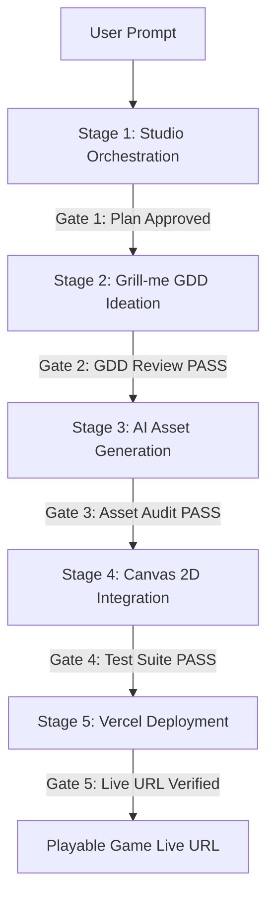

# H5 Game Studio Pipeline

> An open-source, studio-grade agentic workflow skill for transforming a single creative prompt into an online-deployed, playable H5 Canvas 2D web game.

## Overview

The **H5 Game Studio Pipeline** operates on an **Orchestrator Architecture**: a lead agent (acting as Studio Producer / Orchestrator) diagnoses project stage, routes specialist tasks, enforces quality gates, and assembles final deliverables without directly editing code or creating art.

```
                  ┌──────────────────────────────────────────────┐
                  │          Orchestrator (Lead Agent)           │
                  │   Diagnoses ➔ Routes ➔ Gates ➔ Assembles    │
                  └──────┬──────────────┬──────────────┬─────────┘
                         │              │              │
        ┌────────────────┴┐    ┌────────┴────────┐   ┌─┴───────────────┐
        │design-strategist│    │  art-director   │   │engineering-lead │
        │  (grill-me/GDD) │    │(agnes-ai/Assets)│   │ (Canvas2D Code) │
        └─────────────────┘    └─────────────────┘   └─────────────────┘
```

## When to Use

- **Full Lifecycle Game Creation**: User provides a prompt (e.g., *"Build a dark-fantasy pixel idle RPG with an auction house"*) and expects an online-deployed game.
- **Structured GDD Ideation**: Decomposing vague ideas into a rigorous Game Design Document via interactive reverse interviews (*grill-me mode*).
- **Automated AI Asset Pipeline**: Generating and integrating character sprites, weapon PNGs, and skill badges using AI image generation (`agnes-ai`).
- **Canvas 2D Framework Integration**: Integrating generated assets into standard H5 Canvas 2D engines without rewriting core rendering loops.
- **Serverless Production Deployment**: Deploying the game to Vercel with cloud DB persistence (Turso/LibSQL) and environment secret isolation.

Do **NOT** use when:
- Fixing localized syntax bugs or single-function issues (route directly to `engineering-lead`).
- Modifying standard backend APIs without affecting game mechanics or UI design.

---

## The 5-Stage Pipeline



| Stage | Milestone Name | Lead Specialist | Key Deliverable | Quality Gate (Pass Criteria) |
|-------|----------------|-----------------|-----------------|------------------------------|
| **1** | Studio Orchestration | Orchestrator | Execution Plan | User explicit approval of plan |
| **2** | Grill-me GDD Ideation | `design-strategist` | `docs/GDD.md` | Core loop, mechanics & balance complete |
| **3** | AI Asset Generation | `art-director` (+ `agnes-ai`) | PNG Sprites & Icons | Specs, transparency & fallback PASS |
| **4** | Canvas 2D Integration | `engineering-lead` | Runnable Canvas Game | Registry check & test suite 100% PASS |
| **5** | Vercel Deployment | `release-ops-lead` | Live Vercel Production URL | HTTP 200 health check & online play verified |

---

## Workflow Execution SOP

### Stage 1: Studio Orchestration (主理人统筹)
1. Inspect project structure (`index.html`, `config.js`, `server/db.js`, `api/index.js`, `vercel.json`).
2. Identify existing features, assets, and database architecture.
3. Formulate a 5-stage milestone execution plan.
4. **Gate 1**: Present the plan to the user. **Obtain explicit user approval before proceeding.**

### Stage 2: Grill-me GDD Ideation (grill-me 拆解)
1. Spawn `design-strategist` in *grill-me* interview mode (see [grill-me-framework.md](file:///C:/Users/hu397/.gemini/config/skills/h5-game-studio-pipeline/references/grill-me-framework.md)).
2. Conduct reverse questioning across 4 dimensions:
   - **Core Verb & Loop**: Combat, movement, idle progression, resources.
   - **Visual & Audio Aesthetic**: Dark fantasy, pixel art, cyberpunk, VFX.
   - **Progression & Economy**: Stat scaling, gear rarities, gold sinks.
   - **Unique Features**: Auction house, skill trees, boss phases.
3. Provide 2–4 concise options for key design choices.
4. Output structured `docs/GDD.md` (see [gdd-template.md](file:///C:/Users/hu397/.gemini/config/skills/h5-game-studio-pipeline/references/gdd-template.md)).
5. **Gate 2**: User reviews and approves GDD.

### Stage 3: AI Asset Generation (免费文生图自动生成)
1. Spawn `art-director` to craft prompts based on `docs/GDD.md`.
2. Invoke `agnes-ai` skill (`agnes-image-2.1-flash`) to generate:
   - Character Class Avatars (`art-app/assets/<class>_front.png`)
   - 16 Weapon Icons (`assets/weapons/<weaponType>.png`)
   - Skill Icons (`art-app/assets/icon_<skillId>.png`)
3. Execute `python scripts/make_transparent.py` to produce clean PNG alpha channels.
4. **Gate 3**: Verify image files exist, have non-zero size, and meet resolution specs.

### Stage 4: Canvas 2D Integration (Canvas 2D 自动接入)
1. Spawn `engineering-lead` to map generated assets into `config.js` and engine loops (see [asset-mapping.md](file:///C:/Users/hu397/.gemini/config/skills/h5-game-studio-pipeline/references/asset-mapping.md)).
2. Preserve native Canvas 2D rendering pipeline and fallback mechanisms (`PNG -> SVG -> Emoji`).
3. Run automated registry check `node scripts/verify_integration.js` and logic tests.
4. **Gate 4**: All logic tests and integration checks return 100% PASS.

### Stage 5: Vercel Deployment (Vercel 自动化部署)
1. Spawn `release-ops-lead` (see [vercel-deploy.md](file:///C:/Users/hu397/.gemini/config/skills/h5-game-studio-pipeline/references/vercel-deploy.md)).
2. Verify `vercel.json` API rewrites (`/api/(.*)` -> `api/index.js`).
3. Deploy via `npx vercel --prod` with cloud database secrets (`TURSO_DATABASE_URL`, `TURSO_AUTH_TOKEN`).
4. Perform HTTP GET health check on deployed endpoint (`/api/health`).
5. **Gate 5**: Output live playable URL and confirm cloud save & auction house functionality.

---

## Studio Roles & Subagent Routing Table

| Trigger Keyword / Focus | Spawn Target | Primary Deliverable |
|-------------------------|--------------|---------------------|
| GDD, 概念, 创意, grill-me, 关卡, 数值, 叙事 | `design-strategist` | System & Game Design, GDD, Grill-me Interview |
| 架构, 引擎, 代码, 性能, 集成, 接入 | `engineering-lead` | Code Architecture, Canvas 2D Engine Integration |
| 美术, 视觉, 资产规格, 特效, 图标 | `art-director` | Art Specs & `agnes-ai` Image Generation |
| 音乐, 音效, 混音 | `audio-director` | SFX & BGM Implementation Strategy |
| 测试, 冒烟, 回归, 质量门 | `quality-lead` | Test Suite Execution & Gate Verdicts |
| 发布, 部署, vercel, 线上链接 | `release-ops-lead` | Vercel Deployment & Secret Verification |

---

## Iron Laws & Red Flags

> [!IMPORTANT]
> **Core Principle**: Orchestrator orchestrates only. It NEVER writes GDD text, game code, or image files directly.

### Iron Laws
1. **Orchestrator Orchestrates Only**: The lead agent coordinates subagents and enforces quality gates, never writing GDD, code, or assets directly.
2. **Strict Handoff Boundary**: Specialist subagents do not communicate directly; all context handoffs route through the Orchestrator.
3. **No Unapproved Modifications**: File writes require explicit user awareness or approval.
4. **Quality Gates Mandatory**: Stage progression is forbidden until the Quality Gate PASS criteria are met.

### Rationalization Table & Countermeasures

| Agent Rationalization | Reality & Enforcement Rule |
|-----------------------|----------------------------|
| *"The prompt is simple enough to skip Stage 2 grill-me."* | **Forbidden.** Vague prompts lead to mismatched assets and broken Canvas mappings. Grill-me is mandatory. |
| *"Writing code directly in parent context saves tokens."* | **Forbidden.** Violates Orchestrator separation of concerns and pollutes main context window. |
| *"Deployed directly to Vercel without running tests to save time."* | **Forbidden.** Untested serverless code causes silent runtime crashes on Vercel. Run tests first. |

---

## Reference & Utility Guide

- 📄 [studio-roles.md](file:///C:/Users/hu397/.gemini/config/skills/h5-game-studio-pipeline/references/studio-roles.md) — Detailed 7-role prompts & handoff contracts.
- 📄 [phase-sop.md](file:///C:/Users/hu397/.gemini/config/skills/h5-game-studio-pipeline/references/phase-sop.md) — Complete 5-stage SOP & Quality Gate checklists.
- 📄 [grill-me-framework.md](file:///C:/Users/hu397/.gemini/config/skills/h5-game-studio-pipeline/references/grill-me-framework.md) — Grill-me reverse interview framework & options guide.
- 📄 [gdd-template.md](file:///C:/Users/hu397/.gemini/config/skills/h5-game-studio-pipeline/references/gdd-template.md) — Master Game Design Document Markdown template.
- 📄 [asset-gen-spec.md](file:///C:/Users/hu397/.gemini/config/skills/h5-game-studio-pipeline/references/asset-gen-spec.md) — AI Text-to-Image prompt engineering & transparency spec.
- 📄 [asset-mapping.md](file:///C:/Users/hu397/.gemini/config/skills/h5-game-studio-pipeline/references/asset-mapping.md) — Canvas 2D engine asset mapping & fallback spec.
- 📄 [vercel-deploy.md](file:///C:/Users/hu397/.gemini/config/skills/h5-game-studio-pipeline/references/vercel-deploy.md) — Vercel serverless deployment & Turso DB guide.
- 🐍 [make_transparent.py](file:///C:/Users/hu397/.gemini/config/skills/h5-game-studio-pipeline/scripts/make_transparent.py) — Automated PNG alpha transparency tool.
- ⚡ [verify_integration.js](file:///C:/Users/hu397/.gemini/config/skills/h5-game-studio-pipeline/scripts/verify_integration.js) — Automated integration & asset registry check script.
